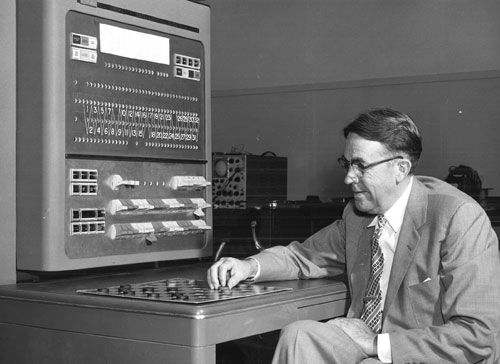
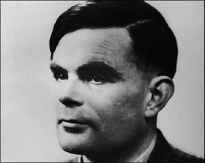
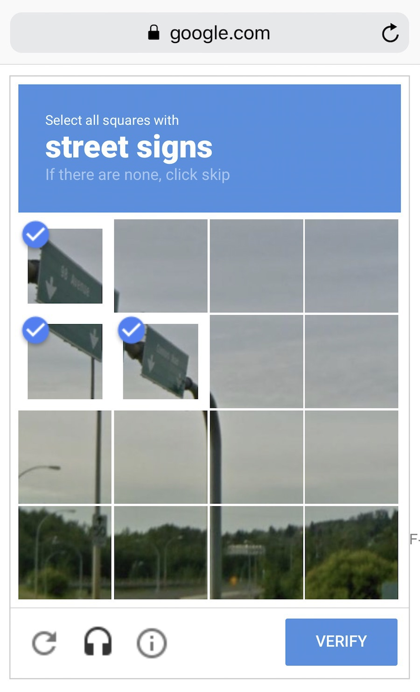
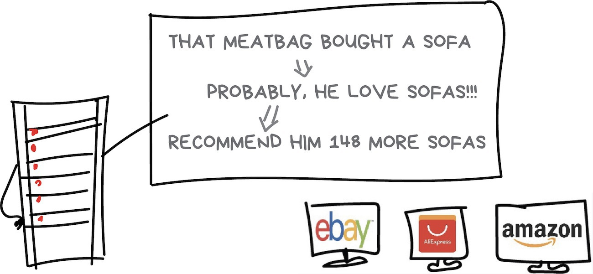
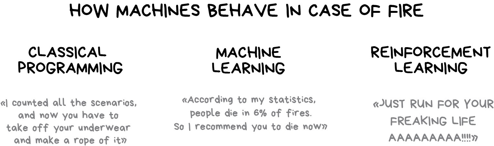

```{r setup, include=FALSE}
knitr::opts_chunk$set(echo = FALSE)
```

## Курс Машинне навчання

**(Дуже приблизний) План курсу:**
 
 1. Мова R. Основи, статистика та робота з даними.
 2. Оглядовий аналіз даних. Зчитування, очистка, семплінг. Візуалізація.
 3. Навчання без вчителя
 4. Навчання з вчителем

Багато роботи з реальними датасетами, лабораторні роботи (5-6 шт) проекти з Kaggle

NB! Нейромереж не буде.

## Методи і алгоритми

    - Linear Regression
    - Multiple Linear Regression
    - Polynomial Linear Regression
    - Support Vector Regression
    - Decision Tree Regression
    - Random Forest Regression
    - K-Nearest Neighbour (KNN) Classification
    - Support Vector Machine (SVM) Classification
    - Naive Bayes Classification
    - Decision Tree Classification
    - Random Forest Classification
    - K-Means Clustering
    - Hierarchical Clustering
    - Natural Language Process (NLP)
    - Principal Component Analysis (PCA)

## Мова курсу R

Причини:

* R нещодавно була мова №1 для роботи з даними
* R більш візуальний і повністю аналогічний Пайтону
* Пайтон ви вивчите і так
* Знати дві мови краще ніж одну

...


## Статистичне навчання

> “Statistics as the science of learning from data, and of measuring, controlling, and communicating uncertainty is the most mature of the data sciences.” Discovery with Data: Leveraging Statistics with Computer Science to
Transform Science and Society by American Statistical Association (ASA)

> “Over the past 50 years, the study of machine learning has grown from the efforts of a handful of computer engineers exploring whether computers could learn to play games, and a field of statistics that largely ignored computational considerations, to a broad discipline that has produced fundamental statistical-computational theories of learning processes.” Tom Mitchell

## Машинне навчання {.flexbox .vcenter}

```{r, out.width = "200px"}

```
  Програма, яка грала в шашки (Samuel Checkers-Playing Program) була найпершою відомою програмою, яка вміла вчитись. Вона була розроблена в 1959 Артуром Лі Семюелом, одним з батьків області машинного навчання.
</div>

## Що таке машинне навчання?

Фундаментальна проблема машинного навчання відповідно до Тома Мітчела: 

> “How can we build computer systems that automatically improve with experience,
and what are the fundamental laws that govern all learning processes?”

> “How can we build machines that solve problems, and which problems are inherently tractable/intractable?” 

## Алан Тюрінг

<div class="columns-2">

```{r, out.width = "200px"}

```

У статті «Обчислювальні машини та розум», опублікованій 1950 Тюрінг поставив собі за мету визначити, чи може машина мислити як людина.
Стандартна інтерпретація цього тесту звучить наступним чином: «Суддя взаємодіє з одним комп'ютером і однією людиною. На підставі відповідей на питання суддя повинен визначити, з ким він розмовляє: з людиною чи з комп'ютерною програмою. Завдання комп'ютерної програми — ввести суддю в оману, змусивши зробити неправильний вибір».
</div>

## Чатботи

В 2015 Google натренувала агента, який міг не тільки цілком пристойно взаємодіяти з людьми, але й дискутувати на теми моралі, виражати власну думку та відповідати на загальновідомі питання. 

**Human**: What is the purpose of life?

**Machine**: To serve the greater good.

**Human**: What is the purpose of living?

**Machine**: To live forever.

**Human**: What is the purpose of existence?

**Machine**: To find out what happens when we get to the planet earth.

---

**Human**: Where are you now?

**Machine**: I'm in the middle of nowhere.

**Human**: What is the purpose of dying?

**Machine**: To have a life.

**Human**: What is the purpose of being intelligent?

**Machine**: To find out what it is.

**Human**: What is the purpose of emotions?

**Machine**: I don't know.

## GPT-2

В минулому році OpenAI представила генератор текстів (будь-яких) на основі навчання без вчителя. Вони згенерували 
колонку для журнала New Yorker. На тему - чому людству не треба боятись штучного інтелекту.

Generated by GPT-2 (including any quotes)

The results of the first year of this work are promising, but the big issues are about to be addressed. I asked Amodei if we should be worried about A.I. surpassing humans in an array of specialized fields. “No, I think we can understand that it’s not going to be a society where people are robots,” he said.

The safety of any new technology often hinges on how it’s regulated. If machines can learn to think for themselves, that might be a concern. But if we really want to replicate human intelligence—as most of us want to—there are several directions that researchers might explore.


## Цікаві прориви у розвитку

В 2014 DeepMind розробила агента, який навчався грати в приставочні ігри. І робив це набагато краще людини. В 2016 році програма AlphaGo перемогла спочатку профі, потім чемпіона світу і нарешті найсильнішого гравця в Го. Причому метод навчання виявився універсальним для всіх однотипних ігор (з повною інформованістю) Го, Шахи, Шогі.

В 2017 перемога в Dota2. Нещодавно матч в Старкрафт. Покерний алгоритм. 

## Термінологія

**Artificial intelligence** is the study of agents that perceive the world around them, form
plans, and make decisions to achieve their goals . Its foundations include mathematics,
logic, philosophy, probability, linguistics, neuroscience, and decision theory. Many
fields fall under the umbrella of AI, such as computer vision, robotics, machine learning,
and natural language processing.

**Machine learning** is a subfield of artificial intelligence . Its goal is to enable computers
to learn on their own. A machine’s learning algorithm enables it to identify patterns in
observed data, build models that explain the world, and predict things without having
explicit pre-programmed rules and models.

## Алгоритми машинного навчання. Приклад

```{r}
# load package and data
library(ggplot2)
data(mpg, package="ggplot2") 
#theme_set(theme_bw())  # pre-set the bw theme.

g <- ggplot(mpg, aes(cty, hwy))

# Scatterplot
g + geom_point() + 
  labs(subtitle="mpg: city vs highway mileage", 
       y="hwy", 
       x="cty", 
       title="Scatterplot with overlapping points", 
       caption="Source: midwest")
```


## Більш красива картинка

Проведіть пряму лінію.

Так, це теж машинне навчання!

```{r,echo=FALSE}
# load package and data
library(ggplot2)
data(mpg, package="ggplot2") 
#theme_set(theme_bw())  # pre-set the bw theme.

g <- ggplot(mpg, aes(cty, hwy))

# Scatterplot
g + geom_point() + 
  geom_smooth(method="lm", se=F) +
  labs(subtitle="mpg: city vs highway mileage", 
       y="hwy", 
       x="cty", 
       title="Scatterplot with overlapping points", 
       caption="Source: midwest")
```

## Регресія може бути і нелінійною

```{r, echo=TRUE, eval=FALSE}
library(ggplot2)
data(mpg, package="ggplot2")

# Scatterplot
theme_set(theme_bw())  # pre-set the bw theme.
g <- ggplot(mpg, aes(cty, hwy))
g + geom_jitter(width = .5, size=1) +
  geom_smooth(method = "loess",se = FALSE) +
  geom_smooth(method = "lm", colour = "green",se = FALSE) + 
  labs(subtitle="mpg: city vs highway mileage", 
       y="hwy", 
       x="cty", 
       title="Jittered Points")
```

## Регресія може бути і нелінійною

```{r, echo=FALSE, eval=TRUE}
library(ggplot2)
data(mpg, package="ggplot2")

# Scatterplot
theme_set(theme_bw())  # pre-set the bw theme.
g <- ggplot(mpg, aes(cty, hwy))
g + geom_jitter(width = .5, size=1) +
  geom_smooth(method = "loess",se = FALSE) +
  geom_smooth(method = "lm", colour = "green",se = FALSE) + 
  labs(subtitle="mpg: city vs highway mileage", 
       y="hwy", 
       x="cty", 
       title="Jittered Points")
```

## Бібліотека caret

```{r,echo=TRUE, eval=FALSE}
require(caret)

model.mtcars_lm <- train(hwy ~ cty,
                         data = mpg,
                         method = "lm"
                        )
coef.icept <- coef(model.mtcars_lm$finalModel)[1]
coef.slope <- coef(model.mtcars_lm$finalModel)[2]

summary(model.mtcars_lm)
```

## Бібліотека caret

```{r,echo=FALSE, eval=TRUE}
require(caret)

model.mtcars_lm <- train(hwy ~ cty,
                         data = mpg,
                         method = "lm"
                        )
coef.icept <- coef(model.mtcars_lm$finalModel)[1]
coef.slope <- coef(model.mtcars_lm$finalModel)[2]

summary(model.mtcars_lm)
```

## Графік

```{r, echo=FALSE}
ggplot(data = mpg, aes(x = cty, y = hwy)) +
  geom_point() +
  geom_abline(slope = coef.slope, intercept = coef.icept, color = "red")
```

## Компоненти машинного навчання

<div class="columns-2">
```{r, out.width = "500px"}
knitr::include_graphics("./Lecture1_files/ml.jpg")
```

* Дані
* Особливості
* Алгоритми

</div>

## Дані

<div class="columns-2">

```{r, out.width = "400px"}

```

Хочете фільтрувати спам? Знайдіть зразки спаму. Хочете передбачити ціни? Завантажте історію коливань цін. Хочете передбачити поведінку користувачів? Записуйте всю їх поведінку на фейсбуцію. Чим більш різноманітні дані, тим краще. Десятки тисяч записів це просто необхідний мінімум для початку. 
Хочете навчити алгоритм розпізнавати будь-які елементи дороги (для автопілоту машин), ну потрібно змусити сотні мільйонів людей розмітити датасет для вас безкоштовно. Як це зробити? 

</div>

## Особливості (Features) та алгоритми

Також відомі як параметри або змінні. Якщо дані зберігаються у вигляді таблиці - немає проблем, змінні - назви колонок. Але якщо це фотографії або потік відео? Вибір особливостей впливає на роботу алгоритмів, їх визначення займає багато часу і також вони є основним джерелом помилок.   

Алгоритми. Тут все просто, алгоритми бувають різні, працюють по різному. Але є одне правило, яке не змінюється: Garbage in - garbage out.

## Нагадую термінологію

**Штучний інтелект** - назва всієї області (як біологія або хімія)

**Машинне навчання** - частина області ШІ. 

**Нейромережі** - один з типів МН.

**Глибоке навчання** - один з методів побудови, навчання та використання нейронних мереж. По суті - архітектура мережі. 

## Мапа машинного навчання

```{r, out.width = "500px"}
knitr::include_graphics("./Lecture1_files/7vx.jpg")
```

## Класичне машинне навчання

```{r}
knitr::include_graphics("./Lecture1_files/7w1.jpg")
```

## XKCD Машинне навчання 

```{r,out.width = "500px"}
knitr::include_graphics("./Lecture1_files/joke3.png")
```

## Навчання з вчителем. Класифікація

Використовується для:
  
  - Фільтрації спаму
  - Визначення мови
  - Пошуку схожих документів
  - Аналізу коментарів
  - Розпізнаванню рукописних знаків
  - Виявленню шахрайства
  
Популярні алгоритми: 

  * Naive Bayes
  * Decision Tree
  * Logistic Regression
  * K-Nearest Neighbours
  * Support Vector Machine

## Навчання з вчителем. Регресія

Використовується для:

  - Прогнозування цін
  - Аналізу попиту і пропозиції в різних галузях
  - Медичного діагностування
  - Пошуку будь-яких кореляції часових залежностей

Популярні алгоритми: 

  * Лінійна регресія
  * Поліноміальна регресія

## Регресія

```{r,out.width = "800px"}
knitr::include_graphics("./Lecture1_files/joke1.png")
```

## Регресія

```{r,out.width = "400px"}
knitr::include_graphics("./Lecture1_files/joke5.png")
```


## Навчання без вчителя. Кластерізація

> "Розділити об'єкти на основі невідомих особливостей. Машина вибирає найкращий спосіб"

Використовується для:

   - сегментації ринку
   - об'єднання близьких точок на карті
   - стиснення зображень
   - розмітки нових даних
   - виявлення анормальної поведінки

Популярні алгоритми: 

  * K-means_clustering
  * Mean-Shift
  * DBSCAN

## Класичний приклад з бібліотеки R 

```{r}
ggplot(data = iris, aes(x = Petal.Length, y = Petal.Width))+
  xlab("Petal Length")+
  ylab("Petal Width") +
  geom_point(aes(color = Species,shape=Species))+
  ggtitle("Petal Length vs Width")
```

## Приклад. Кластерізація методом к-середніх

```{r,out.width = "800px"}
knitr::include_graphics("./Lecture1_files/K-means_convergence.gif")
```

## Зменшення розмірності

Використовується для:
  - Рекомендаційних систем
  - Візуалізації
  - Пошуку документів
  - Керування ризиками

Популярні алгоритми: 

  * Principal Component Analysis (PCA)
  * Singular Value Decomposition (SVD)
  * Latent Dirichlet allocation (LDA)
  * Latent Semantic Analysis (LSA, pLSA, GLSA)
  * t-SNE (for visualization)

## Асоціативні правила

> Пошук правил у потоці замовлень

Використовується для:

  - прогнозування продажів і знижок
  - аналіз кошику покупців, що рекламувати і пропонувати
  - розміщення товарів на поличках
  - аналіз поведінки в Інтернеті
  
Популярні алгоритми: 

  * Apriori
  * Euclat
  * FP-growth

## Приклад роботи

```{r,out.width = "1000px"}

```

## Навчання з підкріпленням

> "Кинемо робота у лабіринт і хай він шукає вихід"

Використовується в:

  - Автономні автомобілі
  - роботи-пилососи
  - ігри
  - торгові агенти

Популярні алгоритми: 

  * Q-Learning
  * SARSA
  * DQN
  * A3C
  * Genetic algorithm

## Підсумок

```{r,out.width = "1000px"}

```

## Частини, про які я поки що не планую розказувати

* Ensemble Methods
* Neural Networks and Deep Leaning

## Ефект AI

Чітке визначення границь області ШІ розмите і допускає різні інтерпретації, які з часом змінюються. Як правило під ШІ розуміють задачі, характерні для людської діяльності. Але як тільки комп'ютери навчаються робити це краще за людей, інші заявляють - це не інтелект, це ж просто тупий алгоритм. Так було, коли в 1997 році IBM Deep Blue розгромив Гарі Каспарова. Це сталося вперше в історії, але люди почали говорити, що методи "брют форс" - це не інтелект взагалі і це не справжній інтелект.

> “It’s part of the history of the field of artificial intelligence
that every time somebody figured out how to make a computer do something — play good
checkers, solve simple but relatively informal problems — there was chorus of critics to say,
‘that’s not thinking’”(McCorduck, 2004).

> "AI is whatever hasn't been done yet." - Douglas Hofstadter

Отже, чи є калькулятор ШІ? А автономна машина? А як щодо нового чатботу з вашого власного стартапу (особливо коли потрібно отримати фінансування)?

## One more thing

Останнім часом виникло розділення на слабкий ШІ та сильний ШІ. Слабкий (вузький) - це все що ми зараз маємо, сильний - це алгоритм, здатний вчитись і функціонувати (розв'язувати реальні задачі) краще за людину.

За припущеннями багатьох - це буде останній винахід людини. Далі все будуть розв'язувати машини.

Коли це станеться (точка сингулярності) невідомо 15 - 80 років. Наслідки теж невідомі. 
